# Digital Footprint Manager

## 1. Product Contract

### One-line definition

Digital Footprint Manager is a web service that derives evidence-backed account candidates from a user-authorized email scan, helps the user decide what to keep or clean up, and guides the user through official account-deletion paths without logging in or deleting on the user's behalf.

### Required product language

- Say `account candidate`, not `account`, until the user confirms ownership or evidence is strong.
- Say `discovery confidence`, not `certainty`.
- Say `cleanup priority`, not `breach probability` or `security score`.
- Say `last email evidence`, not `last login` or `last use`.
- Say `known breach association`, not `safe` or `not breached`.
- Say `guided deletion`, not `automatic deletion` or `one-click deletion`.

### MVP outcome

A user can:

1. Understand what email data will be accessed and what will not be stored.
2. Connect Gmail through a user-initiated OAuth flow.
3. Run an in-browser scan for signup, authentication, security, transaction, and subscription evidence.
4. Review deduplicated service candidates with evidence and confidence.
5. Confirm `owned`, `not_mine`, or `unsure`.
6. See cleanup priority only for confirmed or high-confidence candidates.
7. Use a deletion guide, request template, status tracker, and reminders.
8. Export or delete all normalized product data.

## 2. Scope

### In scope

- Web/PWA experience; no extension installation.
- Vercel deployment using Next.js App Router and Node.js Functions.
- Gmail invited-user pilot, then public OAuth release after restricted-scope verification.
- In-browser Gmail queries and metadata parsing.
- Domain/entity resolution and evidence aggregation.
- Discovery confidence and cleanup-priority explanations.
- Manual account creation.
- Korea-first deletion-guide catalog for the top 50 services found in the pilot.
- Official deletion links, prerequisites, request templates, statuses, and reminders.
- Link-out to ePrivacy Clean Service, the Korean privacy portal, or Mozilla Monitor in the first release.
- CSV export and full app-account deletion.

### Explicitly out of scope

- Browser history, cookies, tabs, or browsing-activity analysis.
- Chrome/OS/password-manager saved-login or password access.
- Public-web searches using a person's name, email, phone, or aliases.
- Automatic login, scripted clicking, automatic request submission, or account deletion.
- Collection or relay of passwords, MFA codes, ID documents, or authentication cookies.
- Treating a missing email as proof that an account is inactive.
- Legal representation or a guarantee that all personal data can be deleted.
- Minors, deceased-user accounts, enterprise identity governance, or employee offboarding.

## 3. Core Users and Jobs

### Primary segment

- Age 25-39.
- Same primary email used for at least five years.
- Many accumulated social, shopping, community, and productivity accounts.
- Privacy-aware but unwilling to research every deletion path manually.

### Trigger moments

- A breach notification.
- Quarterly digital cleanup.
- A primary-email or phone-number change.
- A life transition such as moving, marriage, or changing jobs.
- Subscription and shopping-account cleanup.

### Primary job

> When I receive a breach alert or decide to clean up my digital life, help me identify likely old accounts, understand what to handle first, and complete safe cleanup without losing data or subscriptions by mistake.

## 4. UX Flow

```mermaid
flowchart LR
    A[Choose cleanup goal] --> B[Review data-use disclosure]
    B --> C[Connect Gmail]
    C --> D[Run local scan]
    D --> E[Review candidates and evidence]
    E --> F[Confirm owned / not mine / unsure]
    F --> G[Calculate cleanup priority]
    G --> H[Pre-deletion checklist]
    H --> I[Open official deletion path]
    I --> J[User performs final action]
    J --> K[Track status and reminders]
```



### Required result summary

Example only:

```text
63 account candidates
41 high confidence / 14 review / 8 low confidence
8 recommended for cleanup
3 associated with known breaches
```

Do not render `63 accounts found` without the candidate qualifier.

## 5. Discovery Model

### Gmail constraint

Gmail search through `users.messages.list(q=...)` cannot use the `gmail.metadata` scope. Search-based discovery requires a scope such as `gmail.readonly`, which Google classifies as restricted. A public application requires OAuth verification. If restricted data can pass through a third-party server, an annual third-party security assessment may apply. See [S1-S4](#18-sources).

### Chosen boundary

- Use Google Identity Services in the browser.
- Keep the access token in browser memory only.
- Do not request or persist a refresh token in the MVP.
- Call Gmail directly from the browser.
- Request message IDs and only the headers needed for candidate extraction.
- Do not fetch attachments.
- Do not send raw message bodies, subjects, or full sender addresses to the product backend.
- Send normalized candidate data only after user review.

### Scan budget and completeness

- Default to the most recent ten years and run four separate signal-family queries: signup/authentication, security, transaction/subscription, and service notification.
- Cap each family at 500 message IDs and each scan at 2,000 unique metadata fetches after deduplication.
- Fetch metadata with concurrency six; exponentially back off on `429` and `5xx` responses.
- If a cap is reached, label the result `partial scan` and show the covered period, inspected count, and truncated signal families.
- Do not promise exhaustive discovery. Let the user explicitly run an older year window in a later scan.

### Search signal families

Run separate, bounded queries for:

1. Signup and verification: Korean and English equivalents of signup, welcome, verify email, activate account, registration complete.
2. Authentication and security: password reset, login alert, verification code, security alert.
3. Transactions and subscriptions: receipt, payment complete, order, booking, subscription.
4. Service notifications: repeated non-marketing usage notifications.

Newsletter, press, and marketing messages must not independently establish account ownership.

### Candidate normalization

1. Parse sender domain and headers locally.
2. Resolve registrable domain.
3. Map known sender-domain aliases to one `service_id` through the service catalog.
4. Do not merge two brands without an explicit catalog relationship.
5. Aggregate evidence counts and first/last evidence month.
6. Apply confidence scoring.
7. Let explicit user confirmation override the score.

### Discovery confidence

| Evidence | Base points | Interpretation |
|---|---:|---|
| Explicit signup completion or email verification | +35 | Strong account-creation evidence |
| Password reset or login-security alert | +30 | Strong account-existence evidence |
| Repeated transaction, subscription, or service notifications | +20 | Possible account; guest checkout remains possible |
| Single receipt or booking | +10 | Could be a one-time transaction |
| Newsletter or marketing only | +5 | Weak account evidence |
| User confirms ownership | confirmed | User judgment overrides score |

Bands:

- `high`: score >= 70
- `review`: 40 <= score <= 69
- `low`: score <= 39

### Candidate persistence schema

```ts
type CandidateStatus = 'owned' | 'not_mine' | 'unsure';
type DiscoveryBand = 'high' | 'review' | 'low';

interface AccountCandidate {
  id: string;
  userId: string;
  serviceId: string;
  canonicalDomain: string;
  evidenceTypes: Array<'signup' | 'auth' | 'security' | 'transaction' | 'subscription' | 'marketing'>;
  evidenceCount: number;
  firstSeenMonth: string; // YYYY-MM
  lastSeenMonth: string;  // YYYY-MM
  discoveryScore: number;
  discoveryBand: DiscoveryBand;
  userStatus: CandidateStatus;
  createdAt: string;
  updatedAt: string;
}
```

Forbidden persisted fields:

- Message body.
- Attachment.
- Full subject.
- Full sender address.
- Gmail message ID or thread ID after scan completion.
- OAuth access token or refresh token.

## 6. Cleanup Priority

### Rule

Only calculate cleanup priority for candidates that are either:

- explicitly confirmed as `owned`; or
- `high` confidence and not rejected by the user.

This score is an ordering aid, not a probability of compromise.

### Formula

```text
cleanup_priority = known_exposure + data_sensitivity + dormancy_proxy
                 + account_control_gap + cleanup_readiness
```

| Axis | Range | Rule |
|---|---:|---|
| Known exposure | 0-35 | 20 for association with a verified breach; 0-15 more for exposed password, identity, or payment data |
| Data sensitivity | 0-25 | 5 community; 15 shopping/productivity; 25 finance/health/identity/cloud/email |
| Dormancy proxy | 0-20 | 0 within 12 months; 10 for 12-24 months; 20 over 24 months |
| Account-control gap | 0-10 | User-confirmed password reuse, missing MFA, or stale recovery data only |
| Cleanup readiness | 0-10 | Higher when no active balance/subscription/dependency exists and an official route is clear |

Bands:

- `immediate`: 80-100
- `this_week`: 55-79
- `review`: 30-54
- `keep_or_watch`: 0-29

Every score must expose the top two contributing reasons in plain Korean UI text.

### Fixed caveats

- `lastSeenMonth` is not a last-login date.
- No result in a breach data source does not prove safety.
- A service category estimates possible sensitivity; it does not prove which data the service stores for this user.

## 7. Guided Deletion

### Product boundary

The product prepares, routes, explains, tracks, and reminds. The user performs login, identity verification, final confirmation, and request submission on the service's official surface.

### Pre-deletion checklist

- Active subscription, recurring charge, booking, return, or refund.
- Points, coupon, stored value, virtual asset, or credit balance.
- Data export for orders, posts, photos, files, and documents.
- Team, channel, family, or store ownership transfer.
- SSO and recovery-email dependencies.
- Stored payment methods, addresses, and public profiles.
- Correct account/profile confirmation.

### Deletion routes

```ts
type DeletionRoute =
  | 'self_service'
  | 'contact_form'
  | 'email_request'
  | 'support'
  | 'unavailable'
  | 'public_service';
```

| Route | Product provides | User does |
|---|---|---|
| `self_service` | Official URL, web/iOS/Android steps, expected duration, grace period | Logs in, verifies identity, confirms deletion |
| `contact_form` | Official form, issue category, preparation list | Enters data and submits on official site |
| `email_request` | Korean/English draft, subject, allowed and forbidden fields | Reviews and sends through their mail client |
| `public_service` | ePrivacy or privacy-portal link and eligibility explanation | Authenticates and files through the public service |
| `unavailable` | Current evidence and safe alternatives | Chooses data minimization, deactivation, or support escalation |

### State machine

```ts
type CleanupStatus =
  | 'reviewing'
  | 'preparing'
  | 'requested'
  | 'awaiting_confirmation'
  | 'scheduled_for_deletion'
  | 'completed'
  | 'failed_retry';
```

Allowed transitions:

```text
reviewing -> preparing
preparing -> requested
requested -> awaiting_confirmation | scheduled_for_deletion | completed | failed_retry
awaiting_confirmation -> scheduled_for_deletion | completed | failed_retry
scheduled_for_deletion -> completed | failed_retry
failed_retry -> preparing | requested
```

Do not auto-transition to `completed`. Only the user may confirm completion.

### Reminders

- Default reminders: D+3 and D+7 after `requested`.
- If a verified grace-period end date exists, add one reminder on that date.
- Stop reminders at `completed`.
- Never include raw evidence or sensitive data in reminder emails.

### Korean request template

```text
제목: [회원탈퇴 및 개인정보 삭제 요청] {서비스명} / {마스킹된 계정}

안녕하세요. 본 메일 주소와 연결된 계정의 회원탈퇴 및 개인정보 삭제를 요청합니다.
법령상 보존이 필요한 정보가 있다면 보존 항목·근거·기간과 나머지 정보의 삭제 예정일을 알려주세요.
본인확인이 필요하면 비밀번호나 신분증을 일반 이메일로 요구하지 말고 공식 보안 절차를 안내해 주세요.
처리 결과는 이 메일로 회신 부탁드립니다.
```

### English request template

```text
Subject: Account closure and personal data deletion request - {Service}

Please close the account associated with {masked email} and delete personal data that is not subject to a legal retention obligation.
If any data must be retained, please state the category, legal basis, retention period, and expected deletion date.
Please direct identity verification to your official secure channel. Do not request my password by email.
```

### Required distinction warnings

- Removing `Sign in with Google` stops Google-based automatic sign-in; it does not delete the third-party service account or its data [S7].
- Uninstalling an app removes it from the device; it may not delete the service account.
- Unsubscribing from marketing does not close the account.
- Deactivation may be reversible and is not necessarily deletion.
- Account closure can leave legally retained records.

### Service-guide schema

```yaml
service_id: stable_internal_id
display_name_ko: string
canonical_domain: string
sender_domain_aliases: [string]
category: string
deletion_route: self_service | contact_form | email_request | support | unavailable | public_service
platforms:
  web:
    url: https://official.example/path
    steps_ko: [string]
  ios:
    steps_ko: [string]
  android:
    steps_ko: [string]
estimated_minutes: integer | null
grace_period_days: integer | null
recovery_or_reuse_limits_ko: string | null
prerequisites:
  - subscription
  - balance
  - data_export
  - ownership_transfer
  - sso_dependency
identity_verification_ko: string | null
official_source_url: https://official.example/help
source_type: official | public_service | community_seed
last_verified_at: YYYY-MM-DD
verified_by: string
review_due_at: YYYY-MM-DD
broken_report_count: integer
locale: ko-KR
```

### Catalog operations

- Start with the 50 services most frequently found in the pilot.
- Verify the top 20 monthly and all others every 90 days.
- Reverify immediately after three broken-link reports.
- Publish a guide only when it has an official source, verification date, platform route, and pre-deletion impact fields.
- Treat JustDeleteMe as an MIT-licensed seed, not as the final authority [S10].
- Mark stale routes as `needs_review`; do not silently redirect to an unverified fallback.

## 8. Vercel Architecture

### Feasibility verdict

Vercel is a strong fit for the MVP only if the Gmail data boundary remains in the browser. Gmail queries, token handling, header parsing, normalization, and discovery scoring run in a Client Component plus Web Worker. Vercel Functions receive only user-approved normalized candidates and cleanup state. This keeps the server workload short and stateless and preserves the promise that mail metadata is not transmitted to the backend [S18].

```text
src/app
  OAuth consent UI
  candidate review and cleanup workbench
  api/candidates        Route Handler
  api/cleanup           Route Handler
  api/cron/reminders    authenticated Cron Route Handler

src/features/mail-scanner
  Client Component entrypoint
  Gmail query planner
  header parser Web Worker
  domain normalization
  discovery confidence

src/server
  authorization checks
  candidate and cleanup services
  catalog service
  reminder dispatcher

src/db
  managed PostgreSQL client getter
  normalized candidates
  cleanup states
  guide catalog
  reminder outbox and deterministic event keys
```

Recommended implementation baseline:

- Next.js App Router and TypeScript on Vercel.
- Client Components only at the interactive Gmail boundary; browser Worker for parsing and normalization.
- Route Handlers or Server Actions on the Vercel Node.js runtime for authenticated mutations.
- Managed PostgreSQL through a Vercel integration, using a serverless driver or pooler and lazy client initialization.
- Vercel Cron for daily due-reminder and guide-review dispatch; durable state lives in PostgreSQL, not function memory.
- Transactional email provider with a lazily initialized server SDK and sensitive-field redaction.
- Co-locate the database and functions where the chosen provider supports it; verify the current region before launch.
- Keep product authentication separate from Gmail authorization: the backend issues only an HttpOnly product session, while the Gmail access token remains in browser memory.

### Vercel implementation rules

| Concern | Rule | Verification |
|---|---|---|
| OAuth URL | Use one stable QA domain and the Production domain; do not register arbitrary deployment Preview URLs | Actual origin and redirect URI match Google registration |
| Auth separation | Product sign-in never grants Gmail access; request `gmail.readonly` incrementally only when the user starts a scan | Product session and cookies contain no Gmail token |
| Processing boundary | Gmail access stays in Client Component/Worker; database and email stay in Node.js Functions | Zero Gmail token/header fields in Function traffic and logs |
| Database | Use a serverless driver or pooler; initialize lazily. If using a `pg` pool, attach it to Fluid Compute lifecycle | Connection-count load test stays below provider limit [S22] |
| Reminders | Daily Vercel Cron queries due rows; verify `Bearer CRON_SECRET`; create one outbox row per deterministic reminder event; use provider idempotency keys | A same-date replay creates one event; an unknown provider result is investigated instead of blindly resent [S19] |
| Environments | Separate Development, Preview, and Production databases, OAuth clients, and email credentials | Cross-environment credentials fail closed [S20][S21] |
| Secrets | Only the Google browser client identifier may be public; tokens, DB URLs, HIBP keys, and email keys must never use `NEXT_PUBLIC_` | Client bundle contains no secret [S23] |
| Authorization | Proxy may redirect, but every Server Action and Route Handler rechecks user ownership | Cross-user candidate IDs return 403/404 |
| Logs | Never put tokens or sensitive candidate data in URL query strings; redact structured request/error fields | Token, email, subject, and sender scan returns zero matches |

Do not introduce an LLM into discovery for the MVP. Start with deterministic signals, entity catalog, and user confirmation. Reconsider only after a documented error corpus shows a rule-level ceiling.

## 9. Retention and Security Invariants

| Data | Retention | Invariant |
|---|---|---|
| Gmail access token | Browser memory, current session | Clear on disconnect/tab close; never log or persist |
| Message subject/sender/date | Scan memory, max 30 minutes | Never transmit to backend |
| Normalized candidates and user decisions | While product account exists | Per-item delete and full export available |
| Cleanup state | While product account exists | Store dates/method only; no evidence screenshots |
| Product-account deletion | Primary DB within 24 hours | Before launch, verify the database provider supports a backup-retention policy that expires user data within 30 days |
| Security logs | 30 days | No email, subject, token, or message identifier; pseudonymous actor ID |

Mandatory controls:

- Just-in-time disclosure before OAuth.
- Least privilege and incremental authorization.
- TLS in transit and encryption at rest.
- CSP and Trusted Types on sensitive screens.
- Restrict `connect-src` to the application, Google OAuth, Gmail API, and explicitly required providers.
- No third-party analytics scripts on scan and cleanup screens.
- Automated secret/PII redaction in logs, errors, and support tools.
- Audited administrative access.
- No advertising use, retargeting, data sale, or human mail-content review.

## 10. Breach Data

### MVP

- Link to ePrivacy/Privacy Portal or Mozilla Monitor.
- Record only that the user chose to inspect a breach result; do not scrape or infer results.

### Later integration

Prefer HIBP's k-anonymity email lookup when subscription and license terms permit. Two invariants regardless of design: the HIBP API key never reaches the browser, and HIBP is attributed in the result UI. Detailed flow is post-MVP design work [S6].

## 11. MVP Backlog

### Must

- Gmail manual scan.
- Candidate evidence and confidence.
- User ownership decision.
- Entity deduplication.
- Cleanup priority and explanations.
- Top-50 deletion guides.
- Request templates.
- Cleanup state and reminders.
- App-data export and deletion.

### Should

- Google linked-apps guidance.
- Public breach-service link-out.
- CSV export.
- Broken-guide report.
- Korean and English request templates.

### Later

- Outlook `Mail.ReadBasic` delegated integration [S5].
- HIBP k-anonymity integration.
- Multiple email accounts.
- Periodic rescan.
- Family plan.

### Won't

- Everything listed in §2 "Explicitly out of scope", plus advertising-based monetization (§9).

## 12. Delivery Plan

| Period | Deliverable | Gate |
|---|---|---|
| Weeks 1-2 | 20 interviews, synthetic mailbox, 30-guide seed | Repeated trigger and completion needs |
| Weeks 3-6 | Invited web prototype and local scan | High-confidence precision >= 85%; first list <= 5 minutes |
| Weeks 7-10 | Priority, 50 guides, state, reminders, deletion | Cleanup-action start >= 25% |
| Weeks 11-12 | Stable Vercel QA domain, environment separation, Cron/deletion/log tests, 50-100-user beta | Zero mail metadata in server traffic/logs; zero duplicate reminders; zero critical defects |
| Weeks 13-18+ | OAuth verification, Vercel Production domain, policy package, catalog ops | Google verification complete; privacy/security deployment gates pass |

OAuth verification is a release gate, not a fixed calendar promise. Google states that restricted-scope verification can take several weeks [S3].

## 13. Metrics

- Gmail connect completion >= 60%.
- At least 70% of connected users confirm 10 high-confidence candidates within five minutes.
- False-positive rate among high-confidence candidates <= 10%.
- At least 25% of result viewers start one cleanup action.
- At least 40% of started cleanup actions are user-confirmed complete within 14 days.
- Zero raw message bodies, subjects, sender addresses, attachments, OAuth tokens, or passwords in backend storage and logs.

### Go/no-go

- If high-confidence precision < 80%, stop adding features and repair evidence rules/entity resolution.
- If Gmail connect completion < 40%, stop scaling acquisition and test trust copy or a manual-import workflow.
- Any raw-mail or credential leak is a release blocker.

## 14. Monetization Hypotheses

| Offer | Price hypothesis | Scope |
|---|---:|---|
| Free | KRW 0 | One email manual scan, all candidate review, top five guides |
| 30-day Cleanup Pass | KRW 9,900 one-time | All guides, templates, reminders, export, 30-day tracking |
| Plus, later | KRW 4,900/month | Multiple emails, periodic rescan, breach-change alerts, family workbench |

These are test prices, not launch commitments. Do not build recurring monitoring until trust, repeat demand, OAuth, and security-assessment implications are resolved.

## 15. Risks

| Risk | Impact | Mitigation / stop condition |
|---|---|---|
| Gmail permission distrust | OAuth abandonment | Visualize local processing; invited beta; stop if connect < 40% |
| Candidate false positives | Wrong cleanup and trust loss | Candidate language; evidence; user confirmation before priority/deletion |
| Stale deletion guide | Drop-off and wrong route | Official source, verification date, review SLA, broken-link reporting |
| Deletion overclaim | Legal/support dispute | No auto-deletion language; retention caveat; user confirms completion |
| Breach-data overinterpretation | False sense of safety | `known breach` only; fixed no-result caveat |
| Mail data exposure | Critical trust/regulatory failure | Browser boundary, memory token, redacted logs; release blocker |
| Preview OAuth mismatch | Login failure and invalid verification setup | Use one stable QA domain; separate Preview and Production OAuth clients |
| Cron duplicate invocation | Duplicate reminders and trust loss | Transactional outbox, unique event key, state transition, provider idempotency key; do not blindly retry an unknown delivery result |
| Database connection exhaustion | Intermittent 5xx and scaling failure | Serverless driver/pooler, lazy initialization, connection-limit load test |

## 16. Consistency Checklist

- [ ] UI, email, landing copy, and support text distinguish candidates from confirmed accounts.
- [ ] Discovery confidence and cleanup priority are separate fields and visual components.
- [ ] Last email evidence is never described as last login.
- [ ] SSO disconnect, app uninstall, unsubscribe, deactivate, and delete are distinct actions.
- [ ] Every deletion guide shows official source and last verification date.
- [ ] User completes login, identity verification, submission, and final deletion.
- [ ] Raw email, passwords, MFA codes, authentication cookies, and ID documents never reach backend systems.
- [ ] Gmail tokens, subjects, full sender addresses, and exact message timestamps never enter Vercel Function requests or logs; user-approved month buckets are the only time-derived exception.
- [ ] Subscription, balance, export, ownership, and SSO dependencies are checked before deletion.
- [ ] OAuth testing uses a stable QA domain, with separate Preview and Production credentials.
- [ ] Cron replay and concurrency create one reminder event, and an unknown provider result is not blindly resent.
- [ ] Database and backup-provider deletion behavior matches the published 24-hour/30-day policy.
- [ ] Gmail restricted-scope verification is complete before public release.
- [ ] Product-account deletion removes primary data within 24 hours and backups within 30 days.

## 17. Decision Log

### Decision: Web-first; defer browser history - 2026-07-15

**Context:** The original concept assumed a Chrome extension, browser history, and saved-login signals. The user allowed a web-service direction. Visit history is not account evidence, and sensitive extension permissions create a trust barrier.

**Why:** A web service validates value without installation and supports an explicit email-evidence/user-confirmation contract.

**Rejected:** Extension-first because of permission/install friction and the invalid assumption of public saved-password enumeration.

**Status:** Active

### Decision: Human-in-the-loop deletion assistance - 2026-07-15

**Context:** Services differ in login, MFA, balances, subscriptions, grace periods, and legally retained records. A wrong deletion can be irreversible.

**Why:** The user should perform final actions on official surfaces; the product should handle preparation, routing, documents, deadlines, and state.

**Rejected:** Generic one-click deletion because it requires credentials and creates unacceptable failure risk. Link-only support because it does not materially improve completion.

**Status:** Active

### Decision: Client-side Gmail processing; no raw-mail backend - 2026-07-15

**Context:** Gmail search requires restricted OAuth scope. Server access can add verification and recurring security-assessment obligations.

**Why:** Keeping tokens and metadata inside the browser reduces breach scope and aligns the implementation with the product's privacy promise.

**Rejected:** Server-side full-mail scanning and refresh-token storage as disproportionate for the MVP.

**Status:** Active

### Decision: Use Vercel as the web-service operating baseline - 2026-07-15

**Context:** The user selected Vercel. The MVP needs browser-side Gmail processing, short authenticated CRUD requests, managed PostgreSQL, and scheduled reminders.

**Why:** Next.js App Router and Vercel Node.js Functions fit the UI/API workload. Vercel Cron plus durable PostgreSQL state can run D+3/D+7 reminders without a persistent application server. Stable OAuth QA URLs, environment isolation, idempotent Cron, and connection management are release gates.

**Rejected:** Gmail scanning in Vercel Functions because it would move restricted mail data to the server and increase risk. An in-memory job queue because deployments and retries make it non-durable.

**Status:** Active

## 18. Sources

- **S1:** [Google Workspace - Gmail API OAuth scopes](https://developers.google.com/workspace/gmail/api/auth/scopes)
- **S2:** [Google Workspace - users.messages.list](https://developers.google.com/workspace/gmail/api/reference/rest/v1/users.messages/list)
- **S3:** [Google Identity - Restricted scope verification](https://developers.google.com/identity/protocols/oauth2/production-readiness/restricted-scope-verification)
- **S4:** [Google Identity - OAuth 2.0 policies](https://developers.google.com/identity/protocols/oauth2/policies)
- **S5:** [Microsoft Graph permissions reference](https://learn.microsoft.com/en-us/graph/permissions-reference)
- **S6:** [Have I Been Pwned API v3](https://haveibeenpwned.com/API/V3)
- **S7:** [Google Account Help - Manage third-party connections](https://support.google.com/accounts/answer/13533235)
- **S8:** [ePrivacy Clean Service](https://www.eprivacy.go.kr/minwonAgree.do)
- **S9:** [Korean Privacy Portal - Breach and account-withdrawal services](https://www.privacy.go.kr/front/contents/cntntsView.do?contsNo=246)
- **S10:** [JustDeleteMe repository](https://github.com/jdm-contrib/jdm)
- **S11:** [Mozilla Monitor](https://monitor.mozilla.org/)
- **S12:** [Mine](https://www.saymine.com/)
- **S13:** [Chrome Extension public permission list](https://developer.chrome.com/docs/extensions/reference/permissions-list)
- **S14:** [Chromium passwordsPrivate permission definition](https://chromium.googlesource.com/chromium/src/+/main/chrome/common/extensions/api/_permission_features.json)
- **S15:** [Korean Personal Information Protection Act, Article 36](https://www.law.go.kr/%EB%B2%95%EB%A0%B9/%EA%B0%9C%EC%9D%B8%EC%A0%95%EB%B3%B4%EB%B3%B4%ED%98%B8%EB%B2%95/%EC%A0%9C36%EC%A1%B0)
- **S16:** [Korean Personal Information Protection Act, Article 37](https://www.law.go.kr/%EB%B2%95%EB%A0%B9/%EA%B0%9C%EC%9D%B8%EC%A0%95%EB%B3%B4%EB%B3%B4%ED%98%B8%EB%B2%95/%EC%A0%9C37%EC%A1%B0)
- **S17:** [Google Account Help - Delete your Google Account](https://support.google.com/accounts/answer/32046)
- **S18:** [Vercel Functions](https://vercel.com/docs/functions)
- **S19:** [Vercel - Managing Cron Jobs](https://vercel.com/docs/cron-jobs/manage-cron-jobs)
- **S20:** [Vercel - Environment Variables](https://vercel.com/docs/environment-variables)
- **S21:** [Vercel - Deployment Environments](https://vercel.com/docs/deployments/environments)
- **S22:** [Vercel - Connection Pooling with Functions](https://vercel.com/kb/guide/connection-pooling-with-functions)
- **S23:** [Next.js - Environment Variables](https://nextjs.org/docs/app/guides/environment-variables)
