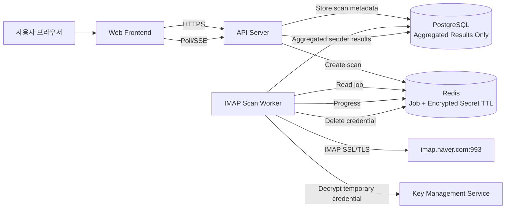
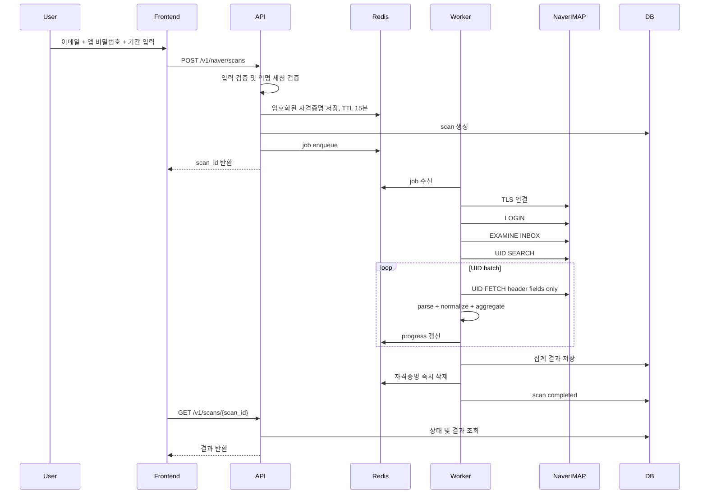
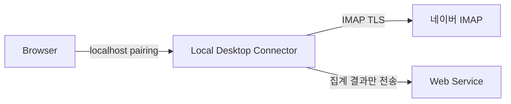

> **STATUS: DEFERRED — NOT AN APPROVED PLAN. DO NOT IMPLEMENT FROM THIS DOCUMENT.**
>
> Evaluated 2026-07-15 against `../PRODUCT_SPEC.md` §8 ("No Naver/Daum mailbox support in the MVP;
> validate the mailbox mix first") and **rejected for now**. The engineering here is sound and
> independently reaches this project's own research conclusions. The problem is not quality: the
> product decision this design assumes was already made the other way, and the design does not
> answer why.
>
> Three objections remain unaddressed — credential authority (a Naver app password grants SMTP,
> not only IMAP, so TTL and encryption bound leak risk but not what we are handed), the
> phishing-template externality that already killed vault import, and Naver's 90-day IMAP
> auto-disable. Its worker/queue/Redis/KMS architecture is also incompatible with §5. The amended
> §8 decision entry carries the full evaluation.
>
> Kept as the starting point **if** the revival condition is met: pilot evidence that
> Korean-service signup mail actually lands in Naver Mail. Reopen the §8 decision first.
>
> Its §14/§15 header rules are salvageable now on the Gmail path and are listed in §8 — they are
> independent of mailbox provider.
>
> Original document below, unmodified.

---

# 네이버 메일 발신자 조회 웹서비스 기술 설계서

> 문서 목적: 구현 에이전트가 별도 해석 없이 MVP를 개발할 수 있도록 요구사항, 제약, 아키텍처, API, 데이터 모델, 보안 규칙, 테스트 및 작업 순서를 정의한다.  
> 기준일: 2026-07-15  
> 상태: Draft / Implementation-ready  
> 대상: 일반 `@naver.com` 개인 메일 사용자  
> 핵심 기능: 사용자의 네이버 메일함에서 **메일 본문을 수집하지 않고 발신자 정보만 추출·집계**한다.

---

## 0. 구현 에이전트용 최우선 지시

아래 규칙은 다른 섹션보다 우선한다.

1. 개인 네이버 메일에는 Gmail API와 같은 공개 Mail OAuth API가 있다고 가정하지 않는다.
2. 네이버 로그인 OAuth 토큰으로 개인 메일함을 조회하려고 시도하지 않는다.
3. MVP는 `IMAP + 애플리케이션 비밀번호` 방식으로 구현한다.
4. 사용자의 네이버 **일반 로그인 비밀번호를 절대 입력받지 않는다.**
5. 애플리케이션 비밀번호는 영구 저장하지 않는다.
6. 메일 본문과 첨부파일은 다운로드하지 않는다.
7. IMAP 메일함은 읽기 전용으로 연다.
8. `BODY.PEEK[HEADER.FIELDS (...)]`처럼 필요한 헤더만 조회한다.
9. 읽음 처리, 이동, 삭제, 라벨 변경 등 메일함 상태를 바꾸는 명령을 실행하지 않는다.
10. 요청 본문, 예외 메시지, APM, 분석 도구, 로그에 자격증명이 남지 않도록 한다.
11. 기존 저장소의 언어·프레임워크가 정해져 있으면 기존 스택을 우선한다.
12. 기존 스택이 없으면 본 문서의 기본 기술 스택을 따른다.
13. 구현 범위가 불분명하면 기능을 확장하지 말고 본 문서의 MVP 범위로 제한한다.
14. 서비스명 매칭, 회원 탈퇴 링크 추천, 본문 분석은 별도 기능으로 분리한다.
15. 모든 보안 관련 실패는 fail-closed 방식으로 처리한다.

---

## 1. 배경과 외부 제약

### 1.1 네이버 로그인과 네이버 메일 접근은 별개다

네이버 로그인은 사용자의 식별자, 이름, 이메일 주소 등 동의받은 프로필 정보를 조회하는 OAuth 로그인 기능이다.  
이 OAuth 토큰을 개인 네이버 메일함의 메일 목록·본문·발신자 조회에 사용할 수 있다고 가정하면 안 된다.

### 1.2 개인 네이버 메일 접근 방식

일반 네이버 메일은 외부 프로그램에서 IMAP을 통해 접근할 수 있다.

- IMAP 서버: `imap.naver.com`
- 포트: `993`
- 보안: SSL/TLS
- 사용자 이름: 네이버 메일 주소
- 비밀번호: 네이버에서 발급한 애플리케이션 비밀번호
- 사전 조건:
  - 네이버 2단계 인증 활성화
  - 네이버 메일의 IMAP/SMTP 사용 설정 활성화
  - 애플리케이션 비밀번호 생성

### 1.3 네이버웍스는 별도 제품이다

NAVER WORKS에는 OAuth 기반 Mail API가 있으나, 본 설계의 대상인 일반 `@naver.com` 개인 메일에는 적용하지 않는다.

---

## 2. 목표

사용자가 웹사이트에 접속하여 네이버 메일 계정을 일회성으로 연결하고, 선택한 기간 또는 메일함에서 발신자를 조회할 수 있어야 한다.

조회 결과는 다음과 같이 집계한다.

- 발신자 표시 이름
- 발신자 이메일 주소
- 발신자 도메인
- 수신 메일 수
- 최초 수신일
- 최근 수신일
- 시스템 추정 유형
  - 개인
  - 기업/서비스
  - 자동 발송
  - 알 수 없음

기본 모드에서는 제목, 본문, 첨부파일, 수신자 목록을 저장하거나 결과 화면에 노출하지 않는다.

---

## 3. 비목표

MVP에서 구현하지 않는다.

- 메일 전송
- 메일 삭제 또는 이동
- 읽음/안읽음 상태 변경
- 첨부파일 다운로드
- 전체 본문 검색
- 네이버 로그인 OAuth 토큰으로 메일함 조회
- 사용자 일반 비밀번호 수집
- 자격증명의 장기 보관
- 실시간 메일 동기화
- 상시 백그라운드 모니터링
- 모든 메일 폴더 자동 탐색
- 서비스별 회원 탈퇴 자동 수행
- 이메일 구독 취소 자동 수행
- 발신자 신원 보증
- 스팸 여부의 법적·절대적 판정

---

## 4. 제품 범위

### 4.1 MVP 범위

MVP는 다음 흐름만 제공한다.

1. 사용자가 서비스에 접속한다.
2. 네이버 메일 연결 안내를 확인한다.
3. 네이버 메일 주소와 애플리케이션 비밀번호를 입력한다.
4. 서버가 IMAP 연결을 검증한다.
5. 사용자가 조회 기간을 선택한다.
6. 서버가 `INBOX`를 읽기 전용으로 조회한다.
7. 서버가 필요한 헤더만 배치로 가져온다.
8. 발신자 주소를 정규화하고 집계한다.
9. 결과를 임시 저장한다.
10. 사용자가 결과를 확인하거나 CSV로 내보낸다.
11. 애플리케이션 비밀번호와 원시 헤더는 즉시 삭제한다.
12. 결과는 TTL 이후 자동 삭제한다.

### 4.2 후속 범위

MVP 안정화 후 고려한다.

- 사용자 지정 폴더 선택
- 최근 30일 / 90일 / 1년 / 전체 기간
- 서비스 디렉터리와 도메인 매칭
- 회원 탈퇴 페이지 연결
- 뉴스레터 및 자동 발송자 분류
- Gmail OAuth 연동
- NAVER WORKS OAuth 연동
- 데스크톱 로컬 커넥터
- 사용자 계정 기반 결과 저장
- 반복 스캔 및 변경 감지

---

## 5. 핵심 아키텍처 결정

### ADR-001: 서버 측 일회성 IMAP 연결

**결정**

MVP는 웹 백엔드가 사용자가 입력한 애플리케이션 비밀번호로 네이버 IMAP 서버에 연결한다.

**이유**

- 순수 브라우저는 일반적인 웹 API만으로 IMAP TCP 연결을 직접 수행할 수 없다.
- 브라우저 확장 프로그램만으로도 임의의 IMAP TCP 연결을 안정적으로 처리하기 어렵다.
- 별도 데스크톱 앱 설치 없이 웹서비스만으로 제공하려면 서버 측 IMAP 연결이 가장 현실적이다.

**보안 조건**

- 애플리케이션 비밀번호는 영구 저장 금지
- 로그 기록 금지
- 최대 15분 TTL의 암호화된 임시 저장만 허용
- 작업 완료 또는 실패 즉시 삭제
- 메일 본문·첨부파일 수집 금지

### ADR-002: 비동기 스캔 작업

메일 수가 많을 수 있으므로 스캔은 비동기 작업으로 수행한다.

- API 서버: 스캔 작업 생성
- 임시 보안 저장소: 암호화된 자격증명 TTL 저장
- 작업 큐: 스캔 ID 전달
- IMAP Worker: 자격증명 복호화 후 조회
- 결과 저장소: 집계 결과만 저장
- 진행률: 폴링 또는 SSE로 제공

### ADR-003: 익명 사용 우선

MVP는 회원가입 없이 사용할 수 있게 한다.

- 서버가 익명 세션 쿠키 발급
- 스캔 결과는 해당 세션에만 연결
- 세션이 없거나 일치하지 않으면 결과 접근 거부
- 결과 TTL 기본값: 30분
- CSV 다운로드 후 사용자가 즉시 삭제할 수 있음

---

## 6. 기본 기술 스택

기존 저장소에 스택이 없다면 다음을 사용한다.

### Frontend

- Next.js
- TypeScript
- React
- 서버 통신: Fetch API
- 상태 관리: React Query 또는 간단한 서버 상태 훅
- 스타일: 기존 프로젝트 규칙 우선

### Backend

- Python 3.12+
- FastAPI
- Pydantic
- IMAP 클라이언트:
  - 기본: Python 표준 `imaplib`
  - 대안: 유지보수 상태가 양호한 IMAP 라이브러리
- MIME 파싱: Python 표준 `email`
- 작업 큐: Celery 또는 RQ
- 임시 저장소: Redis
- 결과 DB: PostgreSQL
- 암호화: cloud KMS 또는 libsodium 기반 envelope encryption

### Infrastructure

- HTTPS 필수
- API와 Worker를 분리 배포
- Redis private network
- PostgreSQL private network
- KMS 접근 권한은 Worker에 최소 부여
- 시크릿은 환경변수 직접 하드코딩 금지
- 배포 플랫폼의 Secret Manager 사용

---

## 7. 시스템 구성도



---

## 8. 사용자 흐름

### 8.1 연결 전 안내

화면에 명확히 표시한다.

- 일반 네이버 로그인 비밀번호를 입력하지 말 것
- 반드시 네이버 애플리케이션 비밀번호를 사용할 것
- 서비스는 메일 본문과 첨부파일을 저장하지 않음
- 조회가 끝나면 애플리케이션 비밀번호를 폐기할 수 있음
- 필요하면 네이버 보안 설정에서 해당 애플리케이션 비밀번호를 직접 삭제 가능

### 8.2 연결 단계

입력 필드:

- 네이버 이메일
- 애플리케이션 비밀번호
- 기간
  - 최근 30일
  - 최근 90일
  - 최근 1년
  - 전체
- 개인정보 처리 동의
- 일회성 연결 동의

### 8.3 진행 화면

표시 항목:

- 연결 확인 중
- 메일함 확인 중
- 발신자 헤더 조회 중
- 발신자 집계 중
- 완료
- 현재 처리된 메일 수
- 추정 전체 메일 수
- 진행률
- 중단 버튼

### 8.4 결과 화면

기본 열:

| 필드 | 설명 |
|---|---|
| sender_name | 표시 이름 |
| sender_email | 정규화된 이메일 |
| sender_domain | 소문자 도메인 |
| message_count | 메일 수 |
| first_seen_at | 최초 수신일 |
| last_seen_at | 최근 수신일 |
| sender_type | 자동/서비스/개인/알 수 없음 |
| confidence | 분류 신뢰도 |

기능:

- 이메일/도메인 검색
- 메일 수 기준 정렬
- 최근 수신일 기준 정렬
- CSV 다운로드
- 결과 즉시 삭제

---

## 9. 스캔 시퀀스



---

## 10. 상태 머신

```text
CREATED
  -> VALIDATING_CREDENTIALS
  -> CONNECTING
  -> DISCOVERING_MAILBOX
  -> SEARCHING_MESSAGES
  -> FETCHING_HEADERS
  -> AGGREGATING
  -> COMPLETED

모든 처리 상태
  -> CANCELLING
  -> CANCELLED

모든 처리 상태
  -> FAILED
  -> EXPIRED
```

### 상태 정의

| 상태 | 의미 |
|---|---|
| CREATED | 작업 생성 완료 |
| VALIDATING_CREDENTIALS | 입력값 및 임시 자격증명 검증 |
| CONNECTING | 네이버 IMAP TLS 연결 |
| DISCOVERING_MAILBOX | INBOX 확인 |
| SEARCHING_MESSAGES | 기간 조건에 해당하는 UID 검색 |
| FETCHING_HEADERS | 헤더 배치 조회 |
| AGGREGATING | 발신자 정규화·집계 |
| COMPLETED | 성공 |
| CANCELLING | 취소 요청 처리 중 |
| CANCELLED | 사용자 취소 |
| FAILED | 복구 불가능한 오류 |
| EXPIRED | 결과 TTL 만료 |

---

## 11. API 설계

기본 prefix:

```text
/api/v1
```

모든 응답:

```http
Cache-Control: no-store
Pragma: no-cache
X-Content-Type-Options: nosniff
```

### 11.1 스캔 생성

```http
POST /api/v1/naver/scans
Content-Type: application/json
```

요청:

```json
{
  "email": "user@naver.com",
  "app_password": "사용자가 발급한 애플리케이션 비밀번호",
  "range": {
    "type": "days",
    "value": 90
  },
  "mailboxes": ["INBOX"],
  "consent_version": "2026-07-15"
}
```

전체 기간:

```json
{
  "range": {
    "type": "all"
  }
}
```

응답:

```json
{
  "scan_id": "scn_01J...",
  "status": "CREATED",
  "created_at": "2026-07-15T09:00:00+09:00",
  "expires_at": "2026-07-15T09:30:00+09:00"
}
```

검증 규칙:

- `email`은 `@naver.com`으로 끝나야 함
- 앞뒤 공백 제거
- 대소문자 정규화
- `app_password` 빈 문자열 금지
- 최대 길이 제한
- `mailboxes`는 MVP에서 `["INBOX"]`만 허용
- 일반 비밀번호인지 판별하려고 저장하거나 분석하지 않음
- 잘못된 인증은 일반화된 오류로 반환

### 11.2 스캔 상태 조회

```http
GET /api/v1/scans/{scan_id}
```

응답:

```json
{
  "scan_id": "scn_01J...",
  "status": "FETCHING_HEADERS",
  "progress": {
    "processed_messages": 2400,
    "estimated_total_messages": 5000,
    "percent": 48
  },
  "created_at": "2026-07-15T09:00:00+09:00",
  "updated_at": "2026-07-15T09:02:14+09:00",
  "expires_at": "2026-07-15T09:30:00+09:00",
  "error": null
}
```

### 11.3 결과 목록

```http
GET /api/v1/scans/{scan_id}/senders?page=1&page_size=100&sort=-message_count
```

응답:

```json
{
  "items": [
    {
      "sender_name": "Example",
      "sender_email": "notice@example.com",
      "sender_domain": "example.com",
      "message_count": 42,
      "first_seen_at": "2024-04-01T02:10:00Z",
      "last_seen_at": "2026-07-10T11:30:00Z",
      "sender_type": "SERVICE",
      "confidence": 0.83
    }
  ],
  "page": 1,
  "page_size": 100,
  "total": 230
}
```

### 11.4 CSV 다운로드

```http
GET /api/v1/scans/{scan_id}/senders.csv
```

규칙:

- UTF-8 BOM 포함 여부는 한국어 Excel 호환성을 고려해 결정
- CSV Formula Injection 방지
- `=`, `+`, `-`, `@`로 시작하는 셀 값은 안전 처리
- 응답 로그에 결과 본문 기록 금지

### 11.5 스캔 취소

```http
POST /api/v1/scans/{scan_id}/cancel
```

### 11.6 결과 삭제

```http
DELETE /api/v1/scans/{scan_id}
```

삭제 대상:

- scan row 또는 soft-delete marker
- sender aggregate rows
- Redis progress
- Redis credential
- 생성된 임시 CSV
- 캐시

---

## 12. 오류 코드

클라이언트에는 내부 예외를 그대로 전달하지 않는다.

| 코드 | HTTP | 사용자 메시지 |
|---|---:|---|
| INVALID_REQUEST | 400 | 입력값을 확인해 주세요. |
| UNSUPPORTED_EMAIL_DOMAIN | 400 | 현재 개인 네이버 메일만 지원합니다. |
| CONSENT_REQUIRED | 400 | 연결 및 개인정보 처리 동의가 필요합니다. |
| INVALID_CREDENTIALS | 401 | 이메일 주소 또는 애플리케이션 비밀번호를 확인해 주세요. |
| IMAP_DISABLED | 422 | 네이버 메일에서 IMAP 사용 설정을 활성화해 주세요. |
| TWO_FACTOR_OR_APP_PASSWORD_REQUIRED | 422 | 2단계 인증과 애플리케이션 비밀번호 설정이 필요합니다. |
| IMAP_CONNECTION_FAILED | 502 | 네이버 메일 서버에 연결하지 못했습니다. |
| IMAP_TLS_FAILED | 502 | 보안 연결을 설정하지 못했습니다. |
| RATE_LIMITED | 429 | 잠시 후 다시 시도해 주세요. |
| MAILBOX_NOT_FOUND | 422 | 받은메일함을 찾지 못했습니다. |
| SCAN_NOT_FOUND | 404 | 스캔 결과를 찾을 수 없습니다. |
| SCAN_EXPIRED | 410 | 스캔 결과가 만료되었습니다. |
| SCAN_CANCELLED | 409 | 취소된 작업입니다. |
| INTERNAL_ERROR | 500 | 처리 중 오류가 발생했습니다. |

서버 내부에는 원인 코드를 별도로 남기되, 이메일 주소와 비밀번호를 포함하지 않는다.

---

## 13. IMAP 처리 규칙

### 13.1 연결

```text
host = imap.naver.com
port = 993
tls = required
certificate_validation = strict
timeout_connect = 10s
timeout_command = 30s
```

인증서 검증을 우회하지 않는다.

### 13.2 메일함 열기

가능하면 읽기 전용 명령을 사용한다.

```text
EXAMINE INBOX
```

라이브러리에서 `EXAMINE`이 불가능하면 `SELECT INBOX readonly=True`에 해당하는 읽기 전용 모드를 사용한다.

### 13.3 메시지 검색

최근 90일 예시:

```text
UID SEARCH SINCE 16-Apr-2026
```

주의:

- IMAP `SINCE`는 서버 시간·날짜 단위 처리 차이를 고려한다.
- 정확한 UTC 범위 필터링은 조회 후 `Date` 헤더를 파싱하여 2차 적용한다.
- `Date` 헤더가 없거나 파싱 실패한 메일은 별도 카운트한다.

### 13.4 헤더 조회

필수 필드:

```text
FROM
SENDER
REPLY-TO
DATE
MESSAGE-ID
RETURN-PATH
AUTO-SUBMITTED
PRECEDENCE
LIST-ID
```

권장 FETCH:

```text
UID FETCH <uid-set> (
  BODY.PEEK[
    HEADER.FIELDS (
      FROM
      SENDER
      REPLY-TO
      DATE
      MESSAGE-ID
      RETURN-PATH
      AUTO-SUBMITTED
      PRECEDENCE
      LIST-ID
    )
  ]
)
```

조회하지 않는 항목:

- 전체 본문
- HTML 본문
- 텍스트 본문
- 첨부파일
- 전체 MIME 구조
- 수신자 목록
- 참조/숨은참조
- 제목

제목이 제품 기능상 꼭 필요해지는 경우 별도 개인정보 영향 검토 후 opt-in 기능으로 추가한다.

### 13.5 배치 크기

기본값:

```text
UID batch size = 200
```

조정 범위:

```text
100 ~ 500
```

동적 조절:

- 서버 응답 지연 증가 시 배치 축소
- 메모리 사용량 증가 시 배치 축소
- 네트워크 안정적이고 응답 크기가 작으면 확대 가능

### 13.6 재시도

재시도 가능:

- 일시적 네트워크 단절
- IMAP 서버 일시 응답 지연
- worker 일시 장애

재시도 금지:

- 인증 실패
- TLS 검증 실패
- 사용자 취소
- 잘못된 메일 주소
- IMAP 비활성화로 확인된 경우

기본 정책:

```text
max_attempts = 3
backoff = 2s, 5s, 15s
jitter = enabled
```

---

## 14. 발신자 추출 규칙

### 14.1 주소 우선순위

대표 발신자는 다음 우선순위로 결정한다.

1. `From`
2. `Sender`
3. `Return-Path`
4. 주소 없음

`Reply-To`는 대표 발신자 대체값으로 사용하지 않고 별도 메타데이터로만 처리한다.

### 14.2 다중 From

`From`에 여러 주소가 있으면 각각 별도 발신자로 집계한다.

예:

```text
From: A <a@example.com>, B <b@example.com>
```

결과:

```text
a@example.com +1
b@example.com +1
```

### 14.3 표시 이름 디코딩

지원:

- RFC 2047 encoded-word
- UTF-8
- EUC-KR 가능성
- 잘못된 인코딩 fallback

실패 시:

- 표시 이름은 빈 문자열
- 이메일 주소 집계는 계속 수행
- 원시 헤더는 저장하지 않음

---

## 15. 이메일 정규화

함수 이름 예시:

```python
normalize_email_address(raw: str) -> NormalizedEmail | None
```

규칙:

1. 앞뒤 공백 제거
2. 꺾쇠 및 표시 이름 분리
3. 도메인을 소문자로 변환
4. 로컬 파트는 원칙적으로 원문 유지
5. 유니코드 도메인은 IDNA ASCII로 정규화
6. 잘못된 주소는 제외하고 오류 카운트 증가
7. 완전한 Gmail식 점 제거 또는 plus addressing 제거를 전역 적용하지 않는다
8. 네이버 주소의 별칭 정책을 임의 추론하지 않는다
9. 동일성 판단은 기본적으로 정규화된 전체 이메일 문자열 기준
10. 도메인 집계는 registrable domain 기준을 별도로 계산할 수 있다

예:

```text
"Example" <NOTICE@Example.COM>
```

정규화:

```json
{
  "display_name": "Example",
  "email": "NOTICE@example.com",
  "domain": "example.com"
}
```

로컬 파트 소문자화는 공급자별 동작 차이가 있으므로 기본적으로 하지 않는다.  
검색 편의를 위한 별도 `email_search_key`는 전체 소문자 문자열로 저장할 수 있으나 원본 정규화 값과 구분한다.

---

## 16. 발신자 분류

MVP 분류는 휴리스틱 기반이며 절대 판정으로 표시하지 않는다.

### 16.1 유형

```text
PERSON
SERVICE
AUTOMATED
NEWSLETTER
UNKNOWN
```

### 16.2 휴리스틱 예시

AUTOMATED 가중치:

- local part가 `no-reply`, `noreply`, `do-not-reply`, `notification`, `notice`
- `Auto-Submitted` 존재
- `Precedence: bulk`
- `List-ID` 존재
- 발신량이 높고 회신 주소가 없음

NEWSLETTER 가중치:

- `List-ID` 존재
- `Precedence: bulk`
- 일정한 주기로 반복
- 동일 도메인의 다수 자동 주소

PERSON 가중치:

- 자동 발송 헤더 없음
- 발신량이 상대적으로 적음
- 표시 이름과 일반 사용자형 주소
- 단, 추정일 뿐임

### 16.3 신뢰도

```text
0.0 ~ 1.0
```

규칙:

- 단일 휴리스틱만으로 0.9 이상 부여 금지
- UNKNOWN은 0.5 이하
- UI에 “추정” 표시

---

## 17. 데이터 모델

### 17.1 scans

```sql
CREATE TABLE scans (
    id                  VARCHAR(40) PRIMARY KEY,
    session_id_hash     VARCHAR(128) NOT NULL,
    provider            VARCHAR(20) NOT NULL DEFAULT 'NAVER',
    email_hash          VARCHAR(128) NOT NULL,
    email_masked        VARCHAR(255) NOT NULL,
    status              VARCHAR(40) NOT NULL,
    range_type          VARCHAR(20) NOT NULL,
    range_value         INTEGER NULL,
    mailbox_count       INTEGER NOT NULL DEFAULT 1,
    estimated_total     INTEGER NULL,
    processed_messages  INTEGER NOT NULL DEFAULT 0,
    malformed_messages  INTEGER NOT NULL DEFAULT 0,
    sender_count        INTEGER NOT NULL DEFAULT 0,
    error_code          VARCHAR(80) NULL,
    created_at          TIMESTAMPTZ NOT NULL,
    updated_at          TIMESTAMPTZ NOT NULL,
    completed_at        TIMESTAMPTZ NULL,
    expires_at          TIMESTAMPTZ NOT NULL,
    deleted_at          TIMESTAMPTZ NULL
);
```

저장 금지:

- 애플리케이션 비밀번호
- 일반 비밀번호
- access token
- 원시 메일 헤더
- 본문
- 제목
- 첨부파일

### 17.2 sender_aggregates

```sql
CREATE TABLE sender_aggregates (
    id               BIGSERIAL PRIMARY KEY,
    scan_id          VARCHAR(40) NOT NULL REFERENCES scans(id) ON DELETE CASCADE,
    sender_name      TEXT NULL,
    sender_email     TEXT NOT NULL,
    sender_email_key TEXT NOT NULL,
    sender_domain    TEXT NOT NULL,
    sender_type      VARCHAR(20) NOT NULL,
    confidence       NUMERIC(4,3) NOT NULL,
    message_count    INTEGER NOT NULL,
    first_seen_at    TIMESTAMPTZ NULL,
    last_seen_at     TIMESTAMPTZ NULL,
    created_at       TIMESTAMPTZ NOT NULL,
    UNIQUE(scan_id, sender_email_key)
);
```

### 17.3 임시 자격증명

PostgreSQL에 저장하지 않는다.

Redis 예시:

```text
key: scan:{scan_id}:credential
value: encrypted payload
ttl: 900 seconds
```

복호화된 평문은 Worker 메모리에서만 유지한다.

작업 종료 시:

```text
DEL scan:{scan_id}:credential
```

예외 발생 시에도 `finally` 블록에서 삭제한다.

---

## 18. 자격증명 암호화

### 18.1 저장 전

```text
plaintext:
{
  "email": "...@naver.com",
  "app_password": "..."
}
```

절차:

1. API 서버가 랜덤 data encryption key 생성
2. AES-256-GCM 또는 검증된 authenticated encryption 사용
3. payload 암호화
4. data key를 KMS master key로 암호화
5. encrypted payload + encrypted data key를 Redis에 저장
6. TTL 15분
7. 평문 버퍼 참조 제거

### 18.2 로그 마스킹

다음 키 이름은 전역 redact 목록에 추가한다.

```text
password
app_password
credential
authorization
cookie
set-cookie
token
secret
```

HTTP request body logging을 전체 비활성화하거나 해당 endpoint에 대해 금지한다.

### 18.3 메모리

완전한 메모리 삭제를 보장하기 어려운 런타임에서는 다음을 지킨다.

- 평문 유지 시간을 최소화
- 전역 변수 사용 금지
- 캐시 금지
- 예외 객체에 평문 포함 금지
- worker 종료 전 덤프 생성 금지
- core dump 비활성화 검토

---

## 19. 인증과 세션

MVP는 익명 세션을 사용한다.

### 쿠키

```text
HttpOnly
Secure
SameSite=Lax 또는 Strict
짧은 TTL
```

### 권한 검사

모든 scan endpoint는 다음을 검증한다.

```text
hash(current_session_id) == scans.session_id_hash
```

scan ID만 아는 제3자가 결과를 조회할 수 없어야 한다.

### CSRF

상태 변경 endpoint:

- POST create
- POST cancel
- DELETE scan

CSRF 토큰 또는 SameSite + origin 검증을 적용한다.

---

## 20. 개인정보 최소화

### 서버에 남겨도 되는 데이터

- 마스킹된 사용자 이메일
- 이메일의 단방향 HMAC
- 집계된 발신자 이메일
- 집계 수
- 최초/최근 수신 시각
- 작업 상태
- 비식별 운영 메트릭

### 기본적으로 남기지 않는 데이터

- 사용자 앱 비밀번호
- 전체 메일 원문
- 제목
- 본문
- 첨부파일
- 수신자
- 원시 헤더
- 메시지 ID 원문
- 로그인 세션 원문

### 이메일 해시

단순 SHA-256 대신 서버 비밀키를 이용한 HMAC을 권장한다.

```text
HMAC-SHA256(server_secret, normalized_email)
```

이유:

- 이메일 주소 사전 대입 공격 완화
- 동일 사용자 반복 요청의 제한적 식별 가능
- 서버 비밀키 회전 정책 필요

---

## 21. 보안 위협 모델

### 위협 1: 자격증명 로그 노출

대응:

- request body logging 금지
- APM body capture 금지
- error reporting scrubber 적용
- reverse proxy access log에 query/body 미포함

### 위협 2: DB 유출

대응:

- 자격증명 DB 저장 금지
- 결과 TTL
- 최소 데이터만 저장
- DB encryption at rest
- 네트워크 격리

### 위협 3: Redis 유출

대응:

- payload 자체 암호화
- private network
- 짧은 TTL
- ACL
- 비밀번호/인증 적용
- public exposure 금지

### 위협 4: 다른 사용자의 결과 접근

대응:

- 고엔트로피 scan ID
- 세션 소유권 검증
- IDOR 테스트
- 결과 URL 캐시 금지

### 위협 5: IMAP 명령 주입

대응:

- mailbox 이름 allowlist
- UID는 서버 응답에서 얻은 숫자만 사용
- 사용자 문자열을 IMAP 명령에 직접 연결하지 않음
- 기간 형식 검증

### 위협 6: CSV Formula Injection

대응:

- 위험한 시작 문자 escape
- MIME type 명확화
- UTF-8 처리

### 위협 7: 대량 스캔으로 인한 자원 고갈

대응:

- IP 및 session rate limit
- 동시 스캔 제한
- 사용자당 1개 활성 스캔
- 최대 메시지 수 정책
- Worker CPU/memory limit
- timeout
- 큐 길이 보호

### 위협 8: 악성 이메일 헤더

대응:

- 헤더 크기 제한
- MIME 파서 예외 격리
- 제어문자 제거
- HTML 렌더링 금지
- UI 출력 escaping

---

## 22. 제한 정책

권장 초기값:

```text
anonymous scans per IP per hour = 5
active scans per session = 1
maximum messages per scan = 100,000
credential TTL = 15 minutes
result TTL = 30 minutes
scan hard timeout = 20 minutes
header size limit per message = 64 KiB
CSV export size limit = 50 MiB
```

100,000개를 초과하면:

- 작업 중단
- `LIMIT_REACHED` 상태 또는 부분 완료
- UI에 일부 결과임을 명시

---

## 23. 성능 설계

### 메모리 집계

발신자 수가 일반적으로 메시지 수보다 훨씬 적으므로 Worker 메모리에서 해시맵 집계를 우선한다.

```python
aggregates[email_key] = {
    "count": int,
    "first_seen_at": datetime | None,
    "last_seen_at": datetime | None,
    "name_candidates": Counter,
    "classification_features": ...
}
```

메일 수가 매우 많을 경우:

- 일정 배치마다 DB upsert
- 또는 로컬 임시 SQLite 사용 후 완료 시 PostgreSQL로 이동
- 임시 파일은 암호화된 디스크 또는 메모리 기반으로 제한
- 작업 후 즉시 삭제

### 진행률

`EXAMINE` 결과의 EXISTS는 전체 메일 수이지 기간 필터 결과 수와 다를 수 있다.

더 정확한 진행률:

1. `UID SEARCH` 결과 UID 목록 수를 전체량으로 사용
2. 배치 처리 수를 누적
3. `processed / matched_uids` 계산

UID 목록이 매우 크면 전체를 메모리에 올리지 않는 방식도 검토한다.

---

## 24. 개인정보 및 동의 문구 요구사항

UI에는 최소한 다음 사실을 고지한다.

1. 네이버 애플리케이션 비밀번호를 일회성으로 사용한다.
2. 네이버 일반 로그인 비밀번호는 입력하면 안 된다.
3. 서비스가 발신자 관련 헤더를 조회한다.
4. 메일 본문과 첨부파일은 조회·저장하지 않는다.
5. 집계 결과는 일정 시간이 지나면 삭제된다.
6. 사용자가 언제든 작업을 취소하고 결과를 삭제할 수 있다.
7. 사용 후 네이버에서 애플리케이션 비밀번호를 폐기할 수 있다.

동의는 버전 관리한다.

```text
consent_version = YYYY-MM-DD
```

출시 전 국내 개인정보보호 관련 약관·정책 검토를 별도 수행한다.

---

## 25. UX 오류 안내

### 인증 실패

```text
네이버 메일에 연결하지 못했습니다.

다음을 확인해 주세요.
- 네이버 일반 비밀번호가 아니라 애플리케이션 비밀번호를 입력했는지
- 네이버 2단계 인증이 켜져 있는지
- 네이버 메일의 IMAP/SMTP 설정이 '사용함'인지
```

### 서버 연결 실패

```text
네이버 메일 서버에 일시적으로 연결하지 못했습니다.
입력한 비밀번호는 저장되지 않았으며, 다시 시도할 수 있습니다.
```

### 결과 만료

```text
보안을 위해 조회 결과가 자동 삭제되었습니다.
필요한 경우 새 스캔을 시작해 주세요.
```

---

## 26. 로컬 커넥터 대안

장기적으로 서버가 애플리케이션 비밀번호를 받지 않게 하려면 데스크톱 커넥터를 도입할 수 있다.



장점:

- 자격증명이 사용자 기기 밖으로 나가지 않음
- 서버의 자격증명 처리 부담 감소

단점:

- 설치 필요
- 운영체제별 배포
- 코드 서명
- 자동 업데이트
- 로컬 포트 보안
- 피싱 오해 가능성
- 초기 전환율 하락

결론:

- MVP: 서버 측 일회성 IMAP
- 보안 강화 버전: 로컬 데스크톱 커넥터
- 브라우저 확장 프로그램 단독 구현은 기본 대안으로 채택하지 않음

---

## 27. 권장 디렉터리 구조

```text
repo/
├─ apps/
│  ├─ web/
│  │  ├─ app/
│  │  ├─ components/
│  │  ├─ lib/api/
│  │  └─ tests/
│  └─ api/
│     ├─ app/
│     │  ├─ main.py
│     │  ├─ api/routes/
│     │  │  ├─ scans.py
│     │  │  └─ health.py
│     │  ├─ core/
│     │  │  ├─ config.py
│     │  │  ├─ security.py
│     │  │  └─ logging.py
│     │  ├─ models/
│     │  ├─ schemas/
│     │  ├─ services/
│     │  │  ├─ credential_vault.py
│     │  │  ├─ scan_service.py
│     │  │  └─ result_service.py
│     │  └─ workers/
│     │     ├─ tasks.py
│     │     ├─ imap_client.py
│     │     ├─ header_parser.py
│     │     ├─ normalizer.py
│     │     └─ classifier.py
│     └─ tests/
├─ packages/
│  └─ contracts/
├─ infra/
│  ├─ docker/
│  └─ deployment/
├─ docs/
│  ├─ privacy/
│  └─ threat-model/
└─ README.md
```

---

## 28. 주요 인터페이스

### IMAP client

```python
class NaverImapClient:
    def connect(self, email: str, app_password: str) -> None: ...
    def examine_inbox(self) -> MailboxInfo: ...
    def search_uids(self, date_range: DateRange) -> list[int]: ...
    def fetch_sender_headers(self, uids: list[int]) -> list[RawHeaderRecord]: ...
    def close(self) -> None: ...
```

### Header parser

```python
class HeaderParser:
    def parse(self, raw_headers: bytes) -> ParsedMessageHeaders: ...
```

### Aggregator

```python
class SenderAggregator:
    def add(self, message: ParsedMessageHeaders) -> None: ...
    def finalize(self) -> list[SenderAggregate]: ...
```

### Credential vault

```python
class CredentialVault:
    def put(self, scan_id: str, credential: Credential, ttl_seconds: int) -> None: ...
    def get_once(self, scan_id: str) -> Credential: ...
    def delete(self, scan_id: str) -> None: ...
```

`get_once`는 읽은 뒤 바로 삭제하거나 Worker가 소유권을 획득하도록 구현한다.

---

## 29. 의사코드

```python
def run_scan(scan_id: str) -> None:
    credential = None
    client = None

    try:
        update_status(scan_id, "VALIDATING_CREDENTIALS")

        credential = credential_vault.get_once(scan_id)
        if credential is None:
            fail_scan(scan_id, "CREDENTIAL_EXPIRED")
            return

        update_status(scan_id, "CONNECTING")

        client = NaverImapClient(
            host="imap.naver.com",
            port=993,
            tls_required=True,
        )
        client.connect(
            email=credential.email,
            app_password=credential.app_password,
        )

        update_status(scan_id, "DISCOVERING_MAILBOX")
        client.examine_inbox()

        update_status(scan_id, "SEARCHING_MESSAGES")
        uids = client.search_uids(load_scan_range(scan_id))
        set_estimated_total(scan_id, len(uids))

        aggregator = SenderAggregator()
        update_status(scan_id, "FETCHING_HEADERS")

        for batch in chunked(uids, size=200):
            assert_not_cancelled(scan_id)

            records = client.fetch_sender_headers(batch)

            for record in records:
                try:
                    parsed = HeaderParser().parse(record.raw_headers)
                    aggregator.add(parsed)
                except MalformedHeaderError:
                    increment_malformed(scan_id)

            increment_progress(scan_id, len(batch))

        update_status(scan_id, "AGGREGATING")
        results = aggregator.finalize()
        save_aggregates(scan_id, results)

        complete_scan(scan_id)

    except InvalidCredentials:
        fail_scan(scan_id, "INVALID_CREDENTIALS")
    except ImapDisabled:
        fail_scan(scan_id, "IMAP_DISABLED")
    except ScanCancelled:
        cancel_scan(scan_id)
    except Exception as exc:
        log_safe_exception(scan_id=scan_id, exc=exc)
        fail_scan(scan_id, "INTERNAL_ERROR")
    finally:
        if client is not None:
            client.close_safely()

        credential_vault.delete(scan_id)

        if credential is not None:
            credential.clear_references()
```

---

## 30. 테스트 계획

### 30.1 단위 테스트

#### 이메일 파서

- 일반 주소
- 표시 이름 포함
- RFC 2047 인코딩 이름
- 한글 표시 이름
- 다중 From
- From 없음
- 잘못된 주소
- 제어문자 포함
- 매우 긴 헤더
- 유니코드 도메인

#### 날짜 파서

- 정상 RFC 2822
- 시간대 포함
- 시간대 없음
- 잘못된 Date
- 미래 날짜
- 극단적으로 과거 날짜

#### 집계

- 동일 이메일 반복
- 도메인 대소문자
- 표시 이름 변동
- 첫 날짜/마지막 날짜
- 다중 From
- malformed 메시지 제외

#### 분류

- no-reply
- List-ID
- Auto-Submitted
- 일반 개인 주소
- 상충하는 신호

### 30.2 통합 테스트

실제 네이버 계정 대신 기본적으로 mock IMAP 서버를 사용한다.

필수 시나리오:

- 연결 성공
- 인증 실패
- IMAP 비활성화
- 빈 메일함
- 1개 메시지
- 10,000개 메시지
- 배치 중 연결 종료
- 작업 재시도
- 사용자 취소
- 자격증명 TTL 만료
- 결과 TTL 만료
- Worker 비정상 종료
- Redis 장애
- DB 장애

### 30.3 보안 테스트

- request body 로그 미기록 확인
- APM payload 캡처 미기록 확인
- IDOR
- CSRF
- rate limit
- scan ID 추측
- CSV injection
- XSS through display name
- IMAP command injection
- oversized header
- session fixation
- Redis key TTL
- 작업 완료 후 credential key 부재
- 실패 후 credential key 부재

### 30.4 실제 계정 수동 테스트

테스트 전용 네이버 계정을 사용한다.

확인:

- 메일 읽음 상태가 변하지 않음
- 메일 이동/삭제 없음
- 본문 다운로드 없음
- 애플리케이션 비밀번호 폐기 후 재연결 실패
- 일반 로그인 비밀번호 입력 시 성공하지 않음
- 전체 스캔 후 Redis에 credential 없음

---

## 31. 관측 가능성

### 허용 메트릭

- scan_started_total
- scan_completed_total
- scan_failed_total
- scan_duration_seconds
- messages_processed_total
- sender_count
- imap_connection_latency
- imap_command_latency
- worker_memory_usage
- credential_deleted_total
- credential_expired_total

### 금지 메트릭/라벨

- 전체 이메일 주소
- 발신자 이메일 주소
- 앱 비밀번호
- 메일 제목
- 메시지 ID
- 원시 헤더

고카디널리티 개인식별자를 Prometheus label로 사용하지 않는다.

### 안전한 로그 예시

```json
{
  "event": "scan_completed",
  "scan_id": "scn_01J...",
  "message_count": 2300,
  "sender_count": 184,
  "duration_ms": 84231
}
```

금지 로그 예시:

```json
{
  "email": "real-user@naver.com",
  "app_password": "plaintext",
  "headers": "raw mail headers"
}
```

---

## 32. 배포 체크리스트

### 필수

- [ ] HTTPS 강제
- [ ] HTTP 요청 본문 로깅 비활성화
- [ ] APM request body capture 비활성화
- [ ] Redis public network 차단
- [ ] PostgreSQL public network 차단
- [ ] KMS 최소 권한
- [ ] 자격증명 TTL 확인
- [ ] 결과 TTL 확인
- [ ] `Cache-Control: no-store`
- [ ] rate limit
- [ ] CSRF 보호
- [ ] 세션 소유권 검증
- [ ] CSP 설정
- [ ] CSV injection 방어
- [ ] 보안 헤더
- [ ] 개인정보 처리방침
- [ ] 이용약관
- [ ] 장애 시 자격증명 삭제 검증
- [ ] 백업에 자격증명이 포함되지 않는지 확인
- [ ] 운영자 화면에 평문 이메일 최소화
- [ ] 고객 문의용 로그에도 민감정보 없음

### 권장

- [ ] 독립 보안 리뷰
- [ ] 침투 테스트
- [ ] 의존성 취약점 스캔
- [ ] 비밀키 회전 절차
- [ ] 사고 대응 문서
- [ ] 데이터 삭제 감사 로그
- [ ] 운영자 접근 감사 로그
- [ ] Worker egress allowlist 검토

---

## 33. 단계별 구현 작업

### Phase 1: 뼈대

- [ ] Web/API/Worker 프로젝트 생성
- [ ] PostgreSQL 연결
- [ ] Redis 연결
- [ ] scan 상태 모델
- [ ] 익명 세션
- [ ] 기본 API contract
- [ ] health check

완료 조건:

- 스캔 생성 후 상태 조회 가능
- 실제 IMAP 연결은 아직 mock 가능

### Phase 2: IMAP 핵심

- [ ] TLS 연결
- [ ] 로그인
- [ ] `EXAMINE INBOX`
- [ ] UID 검색
- [ ] 헤더 배치 FETCH
- [ ] timeout
- [ ] 안전한 close/logout

완료 조건:

- 테스트 계정에서 읽음 상태 변화 없이 From/Date 헤더만 획득

### Phase 3: 파싱·집계

- [ ] MIME 헤더 파싱
- [ ] 주소 정규화
- [ ] 날짜 파싱
- [ ] 집계
- [ ] sender type 휴리스틱
- [ ] DB 저장

완료 조건:

- fixture 기반 예상 집계 결과와 일치

### Phase 4: 임시 자격증명 보안

- [ ] envelope encryption
- [ ] Redis TTL
- [ ] one-time retrieval
- [ ] finally delete
- [ ] 로그 scrubber
- [ ] APM 설정

완료 조건:

- 성공/실패/취소/worker crash 시나리오 후 자격증명 잔존 없음

### Phase 5: UI

- [ ] 연결 안내
- [ ] 앱 비밀번호 입력
- [ ] 기간 선택
- [ ] 진행률
- [ ] 결과 표
- [ ] 검색·정렬
- [ ] CSV
- [ ] 삭제
- [ ] 오류 안내

### Phase 6: 보안·운영

- [ ] rate limit
- [ ] CSRF
- [ ] IDOR 테스트
- [ ] XSS 테스트
- [ ] CSV injection 테스트
- [ ] 보안 헤더
- [ ] 관측성
- [ ] 데이터 TTL cleanup job

### Phase 7: 출시 전 검증

- [ ] 실제 네이버 테스트 계정 검증
- [ ] 개인정보 고지 검토
- [ ] 부하 테스트
- [ ] 장애 복구 테스트
- [ ] 문서 최신성 재확인
- [ ] 공식 네이버 정책 변경 여부 확인

---

## 34. 완료 정의

MVP는 아래 조건을 모두 만족해야 완료로 본다.

1. 일반 사용자가 별도 설치 없이 웹에서 네이버 메일 발신자 조회를 시작할 수 있다.
2. 네이버 일반 비밀번호가 아닌 애플리케이션 비밀번호를 사용한다.
3. INBOX를 읽기 전용으로 조회한다.
4. 읽음 상태와 메일함 내용이 바뀌지 않는다.
5. 본문과 첨부파일을 수집하지 않는다.
6. 발신자 이메일, 도메인, 횟수, 최초/최근 일자를 집계한다.
7. 결과를 검색·정렬·CSV 다운로드할 수 있다.
8. 앱 비밀번호가 DB, 로그, APM에 남지 않는다.
9. 작업 종료 후 임시 자격증명이 삭제된다.
10. 결과가 TTL 이후 삭제된다.
11. 다른 세션이 결과를 조회할 수 없다.
12. 실패·취소 시에도 자격증명이 삭제된다.
13. 10,000개 이상 메일 테스트를 통과한다.
14. 악성 헤더와 잘못된 인코딩으로 Worker 전체가 중단되지 않는다.
15. 공식 문서에 명시된 네이버 IMAP 접속 조건을 따른다.

---

## 35. 에이전트 실행 순서

구현 에이전트는 다음 순서를 따른다.

1. 저장소 구조와 기존 스택을 확인한다.
2. 본 문서와 충돌하는 기존 요구사항이 있는지 찾는다.
3. 충돌이 없으면 `scans` 상태 모델부터 구현한다.
4. 실제 네이버 연결 전 mock IMAP 서버로 테스트를 만든다.
5. IMAP client를 독립 모듈로 구현한다.
6. 헤더 파서와 집계기를 순수 함수 중심으로 구현한다.
7. 자격증명 임시 저장을 연결한다.
8. 성공 경로보다 먼저 실패·취소 시 삭제 보장을 테스트한다.
9. API를 구현한다.
10. UI를 구현한다.
11. 보안 테스트를 수행한다.
12. 실제 테스트 전용 네이버 계정으로 검증한다.
13. README에 로컬 실행법과 보안 주의사항을 작성한다.
14. 구현 완료 시 변경 파일, 테스트 결과, 미해결 위험을 보고한다.

에이전트는 다음 행동을 하지 않는다.

- 네이버 로그인 OAuth 토큰을 Mail API에 사용하는 코드 작성
- 일반 로그인 비밀번호 지원
- 앱 비밀번호를 PostgreSQL에 저장
- 디버깅 목적으로 자격증명 출력
- 전체 메일 MIME 다운로드
- 자동으로 메일 삭제·이동
- 인증서 검증 비활성화
- 사용자 동의 없이 조회 범위 확대

---

## 36. 향후 서비스 디렉터리 매칭 인터페이스

발신자 조회와 서비스 식별을 분리한다.

```python
class ServiceDirectoryMatcher:
    def match(self, sender_email: str, sender_domain: str) -> ServiceMatch | None:
        ...
```

예상 결과:

```json
{
  "service_id": "example-service",
  "service_name": "Example",
  "matched_by": "domain",
  "confidence": 0.96,
  "account_deletion_url": "https://...",
  "unsubscribe_supported": false
}
```

주의:

- 발신자 도메인만으로 사용자의 실제 가입 여부를 확정하지 않는다.
- 결과 문구는 “가입했을 가능성이 있는 서비스”처럼 표현한다.
- 회원 탈퇴 URL은 공식 도메인 검증과 정기 업데이트가 필요하다.
- 외부 링크 이동 전 피싱 방지 검사를 수행한다.

---

## 37. 공식 참고 자료

- [네이버 로그인 개요](https://developers.naver.com/docs/login/overview/overview.md)
- [네이버 로그인 개발 가이드](https://developers.naver.com/docs/login/devguide/devguide.md)
- [네이버 메일 IMAP/SMTP 설정 및 해제 방법](https://help.naver.com/service/30029/contents/21344?lang=ko)
- [네이버 메일 POP3/IMAP/SMTP FAQ](https://help.naver.com/service/30029/bookmark/24347?lang=ko&osType=COMMONOS)
- [네이버 애플리케이션 비밀번호 사용 방법](https://help.naver.com/service/5640/contents/8584?lang=ko)
- [NAVER WORKS Mail API](https://developers.worksmobile.com/kr/docs/mail)

---

## 38. 최종 결정 요약

```yaml
target_provider: NAVER_PERSONAL_MAIL
mail_access_method: IMAP
imap_host: imap.naver.com
imap_port: 993
transport_security: SSL_TLS_REQUIRED
authentication:
  username: naver_email_address
  password: naver_application_password
  naver_login_oauth_for_mail_access: false

mvp_architecture: server_side_ephemeral_imap
mailbox_scope:
  default:
    - INBOX

data_collection:
  message_body: false
  attachment: false
  subject: false
  sender_headers: true
  date_header: true

credential_storage:
  persistent_database: false
  encrypted_ephemeral_store: true
  ttl_seconds: 900
  delete_on_success: true
  delete_on_failure: true
  delete_on_cancel: true

result_storage:
  aggregated_only: true
  ttl_seconds: 1800

safety:
  read_only_mailbox: true
  body_peek: true
  modify_mailbox: false
  tls_certificate_validation: strict
  request_body_logging: disabled
```
